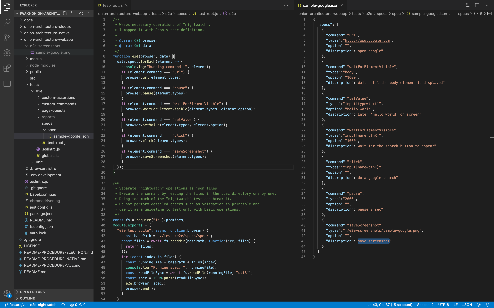
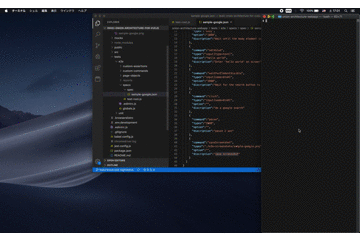

# Overview
 * Separate "nightwatch" operations as json files.
 * Execute the command by reading the files in the spec directory one by one.
 * Doing too much of the "nightwatch" test can break it.
 * Do not perform detailed checks such as validation in principle and
 * use it as a guideline to test only with basic operations.

# Structure


# Running e2e


# logs
```bash
$ yarn test:e2e
yarn run v1.17.3
warning ../../../package.json: No license field
$ vue-cli-service test:e2e
 WARN  Local Chrome version is 80, but the installed chromedriver is for version 79.
 WARN  There may be incompatibilities between them.
 WARN  Please update your chromedriver dependency to match the Chrome version.
 INFO  Starting development server...
Starting type checking service...
Using 1 worker with 2048MB memory limit


 WARNING  Compiled with 2 warnings                                                                                      16:53:26

 warning  

asset size limit: The following asset(s) exceed the recommended size limit (244 KiB).
This can impact web performance.
Assets: 
  js/chunk-vendors.97fcfdf7.js (1010 KiB)

 warning  

entrypoint size limit: The following entrypoint(s) combined asset size exceeds the recommended limit (244 KiB). This can impact web performance.
Entrypoints:
  app (1.21 MiB)
      css/chunk-vendors.d39e9fad.css
      js/chunk-vendors.97fcfdf7.js
      css/app.6b6b0e9d.css
      js/app.2c20f76b.js


No type errors found
Version: typescript 3.5.3
Time: 2927ms

  App running at:
  - Local:   http://localhost:8080/ 
  - Network: http://192.168.1.6:8080/

  App is served in production mode.
  Note this is for preview or E2E testing only.

 INFO  Running end-to-end tests ...

[Test Root] Test Suite
======================
ℹ Connected to localhost on port 9515 (681ms).
  Using: chrome (80.0.3987.87) on Mac OS X platform.

Running:  e2e test suite

Running spec:  ./tests/e2e/specs/spec/sample-google.json
Running command:  {
  command: 'url',
  types: 'http://www.google.com',
  option: '',
  discription: 'open google'
}
Running command:  {
  command: 'waitForElementVisible',
  types: 'body',
  option: '1000',
  discription: 'Wait until the body element is displayed'
}
Running command:  {
  command: 'setValue',
  types: 'input[type=text]',
  option: 'hello world',
  discription: "Enter 'hello world' on screen"
}
Running command:  {
  command: 'waitForElementVisible',
  types: 'input[name=btnK]',
  option: '1000',
  discription: 'Wait for the search button to appear'
}
Running command:  {
  command: 'click',
  types: 'input[name=btnK]',
  option: '',
  discription: 'do a google search'
}
Running command:  {
  command: 'pause',
  types: '2000',
  option: '',
  discription: 'pause 2 sec'
}
Running command:  {
  command: 'saveScreenshot',
  types: './e2e-screenshots/sample-google.png',
  option: '',
  discription: 'save screenshot'
}
✔ 1000
✔ 1000

OK. 2 assertions passed. (5.869s)
✨  Done in 13.64s.
$ 
```

# ./tests/e2e/specs/tes-root.js
```javascript
/**
 * Wraps necessary operations of "nightwatch".
 * I mapped it with Json's spec definition.
 *
 * @param {*} browser
 * @param {*} data
 */
function e2e(browser, data) {
  data.specs.forEach(element => {
    console.log("Running command: ", element);
    if (element.command === "url") {
      browser.url(element.types);
    }
    if (element.command === "pause") {
      browser.pause(element.types);
    }
    if (element.command === "waitForElementVisible") {
      browser.waitForElementVisible(element.types, element.option);
    }
    if (element.command === "setValue") {
      browser.setValue(element.types, element.option);
    }
    if (element.command === "click") {
      browser.click(element.types);
    }
    if (element.command === "saveScreenshot") {
      browser.saveScreenshot(element.types);
    }
  });
}

/**
 * Separate "nightwatch" operations as json files.
 * Execute the command by reading the files in the spec directory one by one.
 * Doing too much of the "nightwatch" test can break it.
 * Do not perform detailed checks such as validation in principle and
 * use it as a guideline to test only with basic operations.
 */
const fs = require("fs").promises;
module.exports = {
  "e2e test suite": async function(browser) {
    const basePath = "./tests/e2e/specs/spec/";
    const files = await fs.readdir(basePath, function(err, files) {
      return files;
    });
    for (const index in files) {
      const runningFile = basePath + files[index];
      console.log("Running spec: ", runningFile);
      const readFileSync = await fs.readFile(runningFile, "utf8");
      const spec = JSON.parse(readFileSync);
      e2e(browser, spec);
      browser.end();
    }
  }
};
```

# ./tests/e2e/specs/spec/sample-google.json
```json
{
  "specs": [
    {
      "command":"url",
      "types":"http://www.google.com",
      "option":"",
      "discription":"open google"
    },
    {
      "command":"waitForElementVisible",
      "types":"body",
      "option":"1000",
      "discription":"Wait until the body element is displayed"
    },
    {
      "command":"setValue",
      "types":"input[type=text]",
      "option":"hello world",
      "discription":"Enter 'hello world' on screen"
    },
    {
      "command":"waitForElementVisible",
      "types":"input[name=btnK]",
      "option":"1000",
      "discription":"Wait for the search button to appear"
    },
    {
      "command":"click",
      "types":"input[name=btnK]",
      "option":"",
      "discription":"do a google search"
    },
    {
      "command":"pause",
      "types":"2000",
      "option":"",
      "discription":"pause 2 sec"
    },
    {
      "command":"saveScreenshot",
      "types":"./e2e-screenshots/sample-google.png",
      "option":"",
      "discription":"save screenshot"
    }
  ]
}
```
